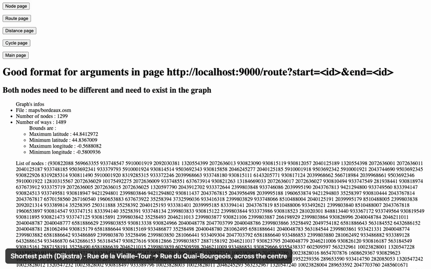
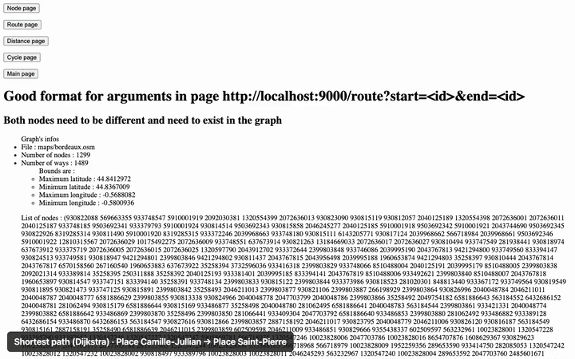
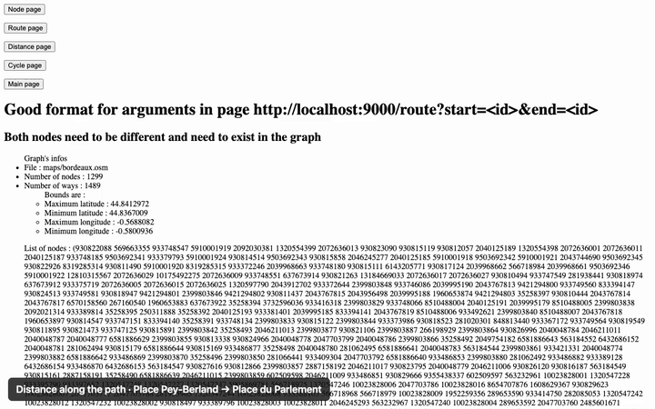
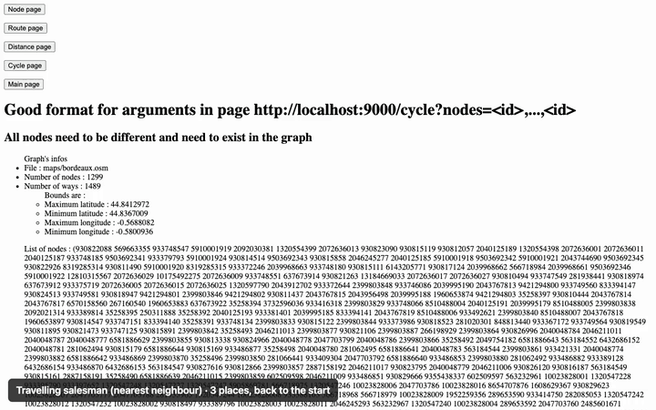
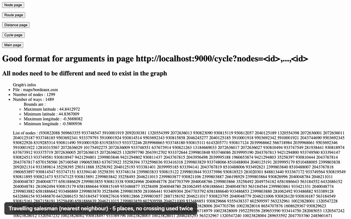
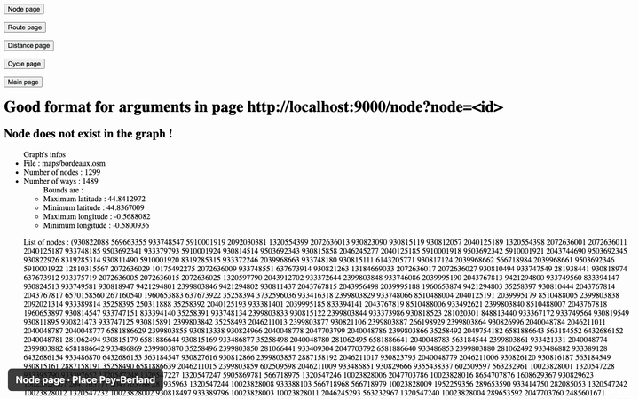
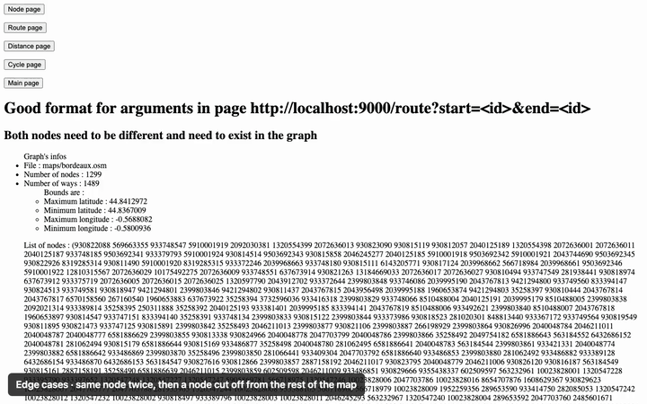

# open-mapping

A small **routing engine in Racket** built on **OpenStreetMap** data: it parses `.osm` files into a graph, computes shortest paths (**Dijkstra**) and short tours (**travelling salesman**, nearest-neighbour heuristic), and renders the result as **SVG** through a local web server.

> School project, ENSEIRB-MATMECA (semester 6, 2020), by Emeric Duchemin, Laurent Genty, Julien Miens and Tanguy Pemeja. Project report: [`Projet_S6_Mapping.pdf`](Projet_S6_Mapping.pdf) (French).



*Bordeaux city centre (1,299 street nodes from OpenStreetMap). The node ids are typed in the real web UI, the server answers with the path drawn in red on the SVG map.*

## Features

- **OSM parsing**: keeps only the routable ways (`highway=*`) from the raw map.
- **Graph construction** with GPS (haversine) distances between nodes.
- **Shortest path** between two nodes with Dijkstra, and its length in meters.
- **Travelling salesman**: a closed tour through a set of nodes with the nearest-neighbour heuristic. Each leg is a Dijkstra that may not reuse a crossing already on the tour, so the tour never goes back on itself.
- **Web UI** served on `localhost:9000` that draws the map and the computed route as SVG.

`src/route.rkt` also holds `find_path`, a greedy best-first search (it always expands the node closest to the target as the crow flies). It was meant to become an A\*, but it does not take the distance already travelled into account, so it is not guaranteed to find the shortest path. The server uses Dijkstra.

## Demos

Each scene drives the real web UI with Playwright: the ids are typed in the forms, then the page scrolls to the map. A caption at the bottom says what is shown. MP4 versions are in [`media/`](media).

| | |
|---|---|
| **Short route**: Place Camille-Jullian → Place Saint-Pierre, 234 m<br> | **Distance**: Place Pey-Berland → Place du Parlement, 648 m<br> |
| **Tour of 3 places**, back to the start<br> | **Tour of 5 places**, no crossing used twice<br> |
| **Node page**: one node highlighted<br> | **Edge cases**: same node twice, then a node cut off from the rest of the map<br> |

## Getting started

Requirements: [Racket](https://racket-lang.org/) (the full distribution, or Minimal Racket with `raco pkg install web-server-lib`).

```bash
racket src/server.rkt maps/bordeaux.osm
```

Then open:

- `http://localhost:9000/route?start=<node-id>&end=<node-id>`: shortest path
- `http://localhost:9000/distance?start=<node-id>&end=<node-id>`: shortest path and its length
- `http://localhost:9000/cycle?nodes=<id>,<id>,<id>`: tour through the given nodes
- `http://localhost:9000/node?node=<node-id>`: one node on the map

For example, on the Bordeaux map: `/route?start=6581917877&end=35258541` (Place Camille-Jullian → Place Saint-Pierre) or `/cycle?nodes=35258541,251542437,6581917877`.

Any map in `maps/` works (ENSEIRB campus, New York, Macapá…). Each page prints the list of node ids of the map.

### Using another area

Export an area from OpenStreetMap, then clip it to its bounds so the long streets crossing the edge do not stretch the map:

```bash
curl -o raw.osm "https://api.openstreetmap.org/api/0.6/map?bbox=-0.5801,44.8367,-0.5688,44.8413"
demo/clip-osm.py raw.osm maps/my-area.osm
```

`maps/bordeaux.osm` was made this way (data © OpenStreetMap contributors, ODbL).

## Tests

```bash
make test
```

- `test/all-tests.rkt`: graph structure (nodes, neighbours, construction).
- `test/test-paths.rkt`: shortest paths on a small map.
- `test/test-bordeaux.rkt`: 24 checks on the Bordeaux map. Six shortest paths are compared with lengths computed independently (a Python Dijkstra on the same file). The other checks cover symmetry, the triangle inequality, paths that only follow streets, no route between two connected components, greedy search never shorter than Dijkstra, and tours of 3 and 5 places that close and never reuse a crossing.

## Recording the demos

```bash
demo/record.sh
```

The script starts the server on `maps/bordeaux.osm`, drives each scene with Playwright (`demo/record.mjs`) and captures timestamped PNG frames. It then encodes the GIFs and MP4s in `media/` and the portfolio clip in `media/portfolio/`. It needs Node.js and `ffmpeg`.

## Fixes made in 2026

The code was run again in 2026 with Racket 9.3. Fixes:

- **Tours always failed** ("Disconnected Universe Error"): after each leg, the reached place was marked as visited instead of the node next to the previous one. The next Dijkstra then started from a visited node and explored nothing.
- **Wrong distance**: the distance page drew the Dijkstra path but showed the length of the greedy search, about twice as long on the Bordeaux map. It now shows the length of the drawn path.
- **Greedy search jumped between non-adjacent nodes**: it recorded a node's predecessor when the node was expanded instead of when it was discovered.
- **Route to an unreachable node** crashed the page. It now shows the "no route" error.
- **Map projection**: the map was stretched to fill 1280×720. Longitudes are now scaled by cos(latitude) and the aspect ratio is kept. The path is drawn thicker, in brighter red.
- Malformed HTML buttons, `Makefile` typo, compiled DrRacket files removed from the repository.

## Project structure

```
src/
  parsing.rkt             # filter OSM ways
  graph_construction.rkt  # build the graph from the filtered data
  graph.rkt               # graph structure and helpers
  gps.rkt                 # distance functions
  Dijkstra.rkt            # Dijkstra + helpers for the TSP
  route.rkt               # greedy path search, path length, distance
  travelling.rkt          # travelling salesman (nearest neighbour)
  commerce.rkt            # early draft of the TSP, not used
  svg.rkt                 # SVG rendering
  server.rkt              # web server
maps/                     # sample .osm maps
demo/                     # OSM clipping and demo recording scripts
media/                    # demo videos
test/                     # tests
```
